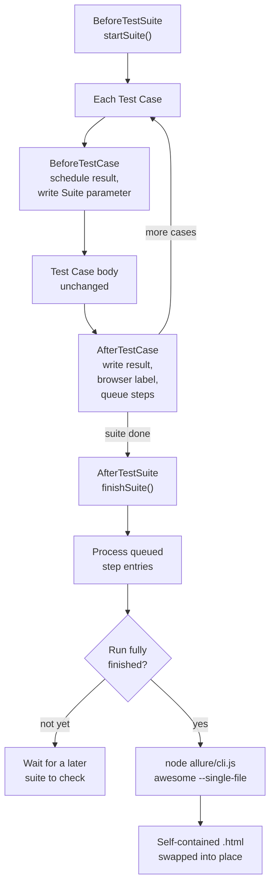
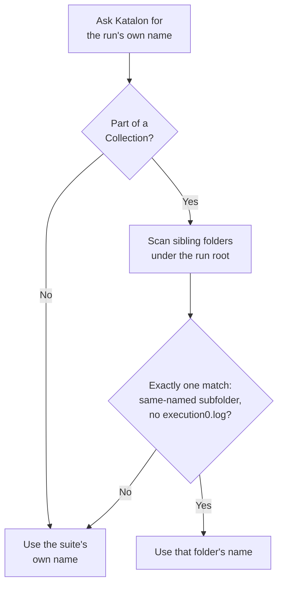

# Architecture

This document explains how the bridge is put together and why the harder
parts work the way they do. It assumes you've read the README's "Why this
exists" table; this goes one level deeper, into the actual mechanics.

Allure 3 changed the *generator*, not the *results format*, so the split
is clean:

| Layer | Status under Allure 3 |
|---|---|
| Katalon listener, lifecycle, cross-process locking, log parsing | unchanged from the Allure 2 bridge |
| Writing `*-result.json` via `allure-java-commons` | unchanged |
| Test identity (`historyId`, `testCaseId`, parameters) | rewritten, see below |
| Invoking the CLI, history, config | rewritten |

Allure 3 ships a built-in `allure2` reader that recognises
`*-result.json`, `*-container.json`, `*-attachment*`, `categories.json`,
`environment.properties` and `executor.json`, so everything the Java side
already wrote keeps working. There is no `allure-java` 3.x, which is why
the two shipped jars stay at 2.35.4.

## Integration point

Katalon Studio auto-discovers any class under `Test Listeners/` and invokes
methods annotated `@BeforeTestSuite` / `@BeforeTestCase` / `@AfterTestCase` /
`@AfterTestSuite` at the corresponding points in a run. That's the entire
integration surface: no plugin registration, no OSGi bundle, no build step.
`Allure3TestListener.groovy` is deliberately thin, four methods each one
line, delegating straight to `Allure3ReportBridge`. Katalon's listener
mechanism is the only part of this system Katalon actually has to know
about.

The alternative, a proper Katalon Studio plugin, was ruled out early. A
plugin bundle needs its own OSGi manifest, a compatible build toolchain, and
a publish/install flow through Katalon Store or a manual `.jar` drop into
Katalon's own plugin folder, all of which turns "add Allure reporting" into
a packaging project instead of a five-minute install. Copying source files
into folders Katalon already auto-compiles avoids all of it.

## Lifecycle, end to end



For a single Test Suite, "every suite in this run" is just the one, so the
right branch is taken immediately. For a Test Suite Collection, member
suites can finish in any order and even in separate processes, so the left
branch is taken by every member except whichever one happens to finish
last.

## Component layout

```
Test Listeners/Allure3TestListener.groovy    Katalon's entry point, pure delegation, no logic
Keywords/allure3/Allure3ReportBridge.groovy  the engine: lifecycle mapping, identity, file I/O, process orchestration
Keywords/allure3/Allure3Config.groovy        allure3.properties + ALLURE3_* env var resolution
Keywords/allure3/Allure3Keywords.groovy      optional manual API (step/attach/label/...), thin wrapper over Allure's own static methods
```

Everything that matters happens in `Allure3ReportBridge`. The other three
files exist to keep that one class's job narrow: config reading, keyword
exposure, and Katalon wiring are each separated out rather than folded in.

## Avoiding the dependency clash

Allure's Java client library pulls in its own Jackson version as a
transitive dependency. Katalon Studio already ships a Jackson version of
its own on every project's classpath. Bringing in Allure's client the
normal way (a build tool resolving its full dependency tree) would put two
different Jackson versions on the same classpath, which fails in whichever
order the classloader happens to resolve them.

Only two jars are shipped: `allure-java-commons` and `allure-model`.
`allure-java-commons` relocates its own Jackson dependency into a shaded,
internal package (`io.qameta.allure.internal.shadowed.jackson.*`) rather
than depending on a plain Jackson artifact, confirmed by inspecting the
jar's actual contents rather than assumed from its published POM.
`slf4j-api` isn't bundled at all, since Katalon's own classpath already
provides a version that satisfies what `allure-java-commons` needs.

## Test identity: the part that matters most

This is the one place where porting the Allure 2 bridge unchanged
produces a **silently wrong report** rather than a degraded one.

Allure 2 honoured whatever `historyId` a result declared. The Allure 2
bridge used that: it hashed the suite name and an occurrence discriminator
into `historyId` itself, so the same reusable Katalon test case run from
two different suites stayed two distinct tests.

Allure 3 ignores a declared `historyId` and recomputes its own:

```js
calculateTestId:    ALLURE_ID label  ->  raw.testId  ->  raw.fullName
calculateHistoryId: `${testCase.id}.${md5(parameters)}`
```

and the allure2 reader maps `testId` from `result.testCaseId`. Retry
grouping is then:

```js
retryHash = md5(`${testCaseId}:${parametersHash}:${environmentId}`)
```

Only the newest attempt in a retry group is displayed.

Two consequences follow, and neither is obvious:

1. **`fullName` is never consulted while `testCaseId` is set.** The
   precedence list stops at `testId`. Rewriting `fullName` to
   disambiguate does nothing.
2. **Katalon reuses one test case across many suites under a single
   `testCaseId`.** So every one of those runs hashes into a single retry
   group, and all but the last disappear.

Measured on a real six-result Katalon run containing one genuine failure,
the Allure 2 bridge's output read by Allure 3 gives:

```
overall status: passed | stats: {"total":2,"retries":2,"passed":2}
```

Six executions collapsed to two, and a failing build reported green.

### What this bridge writes instead

Three fields, each doing a distinct job:

- **`Suite` parameter** (`startTestCase`), feeds `parametersHash`, so the
  same test case run from two different suites is two tests.
- **`browser` label** (`finishTestCase`), what the generated
  `allurerc.mjs` environments matcher keys on, so the same test case run
  against two browsers is two tests.
- **`Browser` parameter** (`finishTestCase`), not redundant with the
  label. See below.

`historyId` is still written, because the allure2 reader carries it
through and it costs nothing to keep correct.

Same run, same results, with these three fields:

```
overall: failed | stats: {"total":6,"passed":5,"failed":1}
```

### Why the browser needs to be both a label and a parameter

An environment separates tests in the report body. It does **not**
separate them in history, because `calculateHistoryId` is
`testCase.id + hash(parameters)` with no environment component.

With the browser as a label only, the Chrome and Firefox runs of one
suite and test case share a single history entry. The newest run
overwrites the other, so a browser-specific failure vanishes from Trend,
and the pass/fail pair makes Allure flag the test **flaky** when nothing
was flaky at all. Measured: 5 history entries for 6 tests, and the entry
for the failing Chrome run recorded as `passed`.

Adding the browser to the parameters gives each browser its own history
line: 6 entries for 6 tests, failure preserved, no spurious flaky flag.

The suite label also no longer carries a `(Browser)` suffix. That was an
Allure 2 workaround for having nowhere better to put the browser; an
environments matcher keys on a label rather than a suffix it would have
to parse back out of a display name.

## State across isolated execution phases

Katalon does not run `BeforeTestSuite`, each test case's
`BeforeTestCase`/`AfterTestCase` pair, and `AfterTestSuite` as one
continuous method call sharing a call stack. They're separate phases, and
for a Test Suite Collection, Katalon can run different member suites in
genuinely separate OS processes rather than threads in the same JVM. A
plain static field written in one phase is not guaranteed to be readable in
another.

Anything that needs to survive across phases is written to a small file
under `allure-results/` instead:

- `.allure3-run-marker.txt`, which run this is, and the last report path generated for it
- `.allure3-pending-steps.txt`, test cases whose step detail still needs parsing
- `.allure3-collection-progress.txt`, which sub-suites of the current run have already finished

A couple of static fields still exist (`currentSuiteName`, the intra-JVM
lock object), but only as fallbacks or same-process synchronization
primitives. Nothing depends on a static field surviving between phases.

## Locking across processes, not just threads

`withRunLock()` guards every place that reads or mutates the files above.
Because a Test Suite Collection can run member suites as separate OS
processes at the same time, a `synchronized` block alone isn't enough: it
only serializes threads inside one JVM. `withRunLock()` combines two
layers, a `synchronized` block on an in-process lock object, and a real
`FileLock` obtained through `RandomAccessFile`/`FileChannel` on a lock file
in `allure-results/`. The file lock is what actually serializes access
across separate processes; the `synchronized` block exists underneath it
because a second `FileLock` attempt from another thread in the *same* JVM
throws `OverlappingFileLockException` instead of blocking, so something
still has to queue same-JVM threads before they reach the file lock at all.

## Deciding when to generate the report

A Test Suite Collection should produce exactly one combined report, written
once every member suite has finished, not regenerated after each one.
`shouldGenerateReportNow()` determines this by comparing the number of
sub-suites Katalon planned for the run (read once from `plan.jsonl`, when
that file is present) against how many distinct suite instances have
reported themselves complete so far, tracked in
`.allure3-collection-progress.txt`.

`plan.jsonl` isn't written by every Katalon Runtime Engine build in every
run mode. When it or the count derived from it isn't available, the
function falls back to returning `true`, generating on every finish. That
fallback is deliberately one-directional: it can only cause the report to
regenerate more often than strictly necessary, never skip the generation
that actually matters. A later suite's `generateHtmlReport()` call always
replaces the previous run's report file rather than adding to it, so
correctness doesn't depend on this optimization firing at all.

## Naming a Test Suite Collection's report

`RunConfiguration.getExecutionSourceName()` is Katalon's public API for the
name of whatever is currently executing, but for a Test Suite Collection it
only ever returns the individual member suite's own name. There is no
public API that hands a Test Listener the enclosing collection's name.

The bridge recovers it from the run's own folder structure instead.
Katalon writes a sibling directory directly under the run's report root,
named after the collection itself, alongside each member suite's own
folder, present before any member suite's `AfterTestSuite` fires. Telling
that folder apart from a member suite's folder takes two conditions
together, not one:

- it has a subfolder named exactly like the run root's own folder (the
  collection's own subfolder always carries the run root's timestamp; a
  member suite's subfolder is timestamped for whenever that suite actually
  started)
- that subfolder does not contain `execution0.log`



Subfolder-name matching alone isn't sufficient: on a fast enough machine, a
member suite can start within the same second the run root folder was
created, so its own subfolder ends up sharing that timestamp too.
`execution0.log` is what breaks the tie. A real member suite always writes
it once it actually runs, regardless of what its subfolder is named; the
collection's own folder never does, since it isn't a suite execution. If
more than one candidate satisfies both conditions, or none do, resolution
falls back to the member suite's own name rather than guessing.

## Step-level detail

Turning a test case's execution log into nested Allure steps can't happen
inside that test case's own `AfterTestCase`: Katalon keeps the log file
open until every `AfterTestCase` listener registered for that test case,
not just this one, has returned. Reading it too early risks a mid-write
parse failure.

Instead, `AfterTestCase` only records a pending entry (test case ID, its
result UUID, its log folder) to `.allure3-pending-steps.txt`.
`AfterTestSuite` processes every currently-pending entry, not just the
finishing suite's own, since whichever suite's `AfterTestSuite` runs first
ends up doing the work for others too when suites run concurrently. Parsing
uses Katalon's own `TestSuiteXMLLogParser` rather than a hand-rolled XML
parser: Katalon's execution logs can contain raw control characters that a
strict parser rejects outright, and Katalon's own parser already strips
them before parsing.

A suite whose log only closes once its own `AfterTestSuite` call returns
creates a narrower timing gap that a short retry loop covers for every
suite except the last one in a run, which has no later suite left to hand
an unparsed entry to. That case falls to a bounded synchronous retry
(up to 20 attempts, one second apart) inside the final suite's own call
instead, rather than a background thread: a CI pipeline that runs one
suite per `katalonc` invocation exits the process almost immediately after
the listener returns, which would kill a background thread before it
finished.

## Writing results

Results are written through Allure's own `AllureLifecycle` /
`FileSystemResultsWriter`, pointed explicitly at a results directory
resolved against the Katalon project root, not left to Allure's own
`allure.results.directory` system property default, since Katalon's
working directory differs between an IDE run, a CLI invocation, and CI.

Step data gets patched into an already-written `<uuid>-result.json` by
hand, field by field, rather than through a generic Gson pass over the
`StepResult` model objects. Allure's own writer uses an internal, shaded
Jackson with custom serializers, lowercased status enum values for
instance, that a generic serialization pass wouldn't reproduce.

## Invoking the CLI

Allure 2's CLI was a Java launcher that had to be found on `PATH`. The
Allure 2 bridge carried a whole resolution ladder for it: configured
path, common install locations per OS, then asking the user's login shell.
A Katalon Studio IDE launched from Finder/Dock/Start Menu never sources
the profile scripts that volta/nvm/sdkman/homebrew rely on, so `allure`
was invisible to it even when `which allure` worked in a terminal.

Allure 3 is a Node program, and this bridge pins it as its own npm
dependency. The installer resolves the exact CLI entry point once and
records it, with the node binary it resolved, in
`.allure3-bridge/cli.json`. The Groovy side then runs
`[node, cli.js, ...]` directly.

That deletes the entire problem class:

- no `PATH` dependence, so the GUI-launch failure mode cannot occur;
- no `cmd /c` wrapper, because there is no `.cmd` shim involved. Java's
  `ProcessBuilder` cannot launch one directly, which is why the Allure 2
  bridge needed the wrapper on Windows;
- no version drift between what the bridge expects and what is installed.

Resolution order, for the cases where the record is missing or stale
(a project committed to git and checked out elsewhere, say):
configured path, then `.allure3-bridge/cli.json`, then a copy vendored
into the project by `--vendor-cli`, then the project's own
`node_modules`, then a bare `allure` on `PATH` for CI images that already
provide one.

Two details worth knowing, both found the hard way:

- The CLI entry point is **`allure/cli.js`**, at the package root, not
  `allure/dist/cli.js` as the rest of the layout suggests.
- `require.resolve` cannot find it. The package declares an `exports` map
  listing only `.`, `./rules` and `./qualityGate`, so Node refuses every
  other subpath, `./package.json` included. The installer walks
  `node_modules` directories upward instead, which also handles npm
  hoisting the dependency above this package.

### Command line differences

- **`--single-file` moved** off `generate` and onto the report plugin, so
  single-file mode runs `allure awesome --single-file`. Multi-file mode
  uses plain `generate`, whose default plugin is awesome anyway, so both
  modes produce the same report and only the packaging differs.
- **`--clean` is gone.** Nothing needs it here: every run generates into
  its own uniquely-named staging directory, and the atomic swap into
  place is what publishes it.
- **`--history-path` is only on the plugin commands.** `generate` reads
  `historyPath` from the config file, which is why the installer writes
  one.

## History

Allure 2 stored history as a `history/` folder inside the generated
report, which had to be copied back into the results directory before the
next generation. The Allure 2 bridge did exactly that, and documented
that it could not work in single-file mode, since there is no report
folder to read history back out of when everything is embedded in one
`.html`.

Allure 3 keeps history in a single external JSONL file, appended on each
generation. Because it lives outside the report, **single-file reports
now carry Trend and Retries forward**. The Allure 2 bridge's
`carryHistoryForward()` is deleted rather than ported; its entire reason
for existing is gone.

## Configuration

The Katalon-facing configuration stays a properties file
(`Include/config/allure3/allure3.properties`), with every key overridable
by an `ALLURE3_*` environment variable, exactly as before.

Allure 3 adds its own config file, which the installer generates at the
project root as `allurerc.mjs`. It holds what the properties file cannot
express, environments plus optionally categories and a quality gate, and
anything it declares wins over the flags the bridge passes.

The generated config deliberately does **not**
`import { defineConfig } from "allure"`. Allure 3 is pinned inside the
bridge's package, not installed into the Katalon project, so that import
fails with `Cannot find package 'allure'`. `defineConfig` is an identity
function used only for TypeScript typing, so exporting the object
directly is equivalent and resolves from any directory.

One constraint worth knowing: Allure 3 restricts environment ids to
latin letters, digits, underscores and hyphens, and rejects anything else
outright. `Edge Chromium` is therefore keyed as `Edge_Chromium`, with the
original spelling kept as the display variable.

## Failure isolation

One rule holds everywhere in `Allure3ReportBridge`: every public entry
point catches `Throwable` and only logs a warning. A bug in report
generation must never fail, skip, or change the outcome of the real test
it's reporting on. This is why config reads, file I/O, and the Allure API
calls throughout the class are wrapped rather than left to propagate. A
broken report is an acceptable failure mode; a broken test result is not.

## Installer

Installing is a plain file copy into `Keywords/`, `Test Listeners/`,
`Include/`, and `Drivers/`, folders Katalon already auto-compiles and
auto-discovers regardless of a project's `.classpath` state, so a copied
file behaves identically whether the project is opened in the IDE, run
from `katalonc` on the command line, or run in CI.

Two things happen beyond a copy. The installer records which Allure 3 CLI
and which node binary to run in `<project>/.allure3-bridge/cli.json`,
which is what lets the Groovy side skip PATH resolution entirely. And it
generates `allurerc.mjs` at the project root with an environment matcher
per browser, since environments are how Allure 3 keeps per-browser runs
distinct.

Every file the installer writes is recorded in
`<project>/.allure3-bridge/manifest.txt`, so uninstall removes exactly
what was installed and nothing else. Generated output and a customized
`allure3.properties` or `allurerc.mjs` are kept by default.

The OS-specific installers under `Windows/`, `macOS/` and `Linux/` are
wrappers, not reimplementations. They handle the platform-specific parts,
finding Node, checking its version, running the one-time `npm install`,
and offering a folder picker, then delegate to `bin/cli.js`. Allure 3's
CLI is a Node program, so Node is a hard requirement for the bridge to
work at all, which makes a second copy of the install logic in PowerShell
and bash pure maintenance cost.

## CI detection

`executor.json`'s CI detection reads each platform's own standard
environment variables directly (`JENKINS_URL`, `TF_BUILD`,
`GITHUB_ACTIONS`, `GITLAB_CI`) rather than requiring configuration.
Whichever one is set determines the executor name and build link written
into the report, with a local, non-CI run as the fallback.

## Coexistence during migration

The Groovy package is `allure3`, the keywords live in `Keywords/allure3/`,
the listener is `Allure3TestListener`, the config is
`Include/config/allure3/`, and the cross-phase state files are
`.allure3-*`. Nothing collides with an existing Allure 2 bridge install,
so both can sit in one project while you migrate.

They should not both be *enabled*, though: two listeners both writing
every test case into the same results directory produces duplicates.
Remove one listener, or set `allure.enabled=false` / `allure3.enabled=false`
on whichever you are not using.
